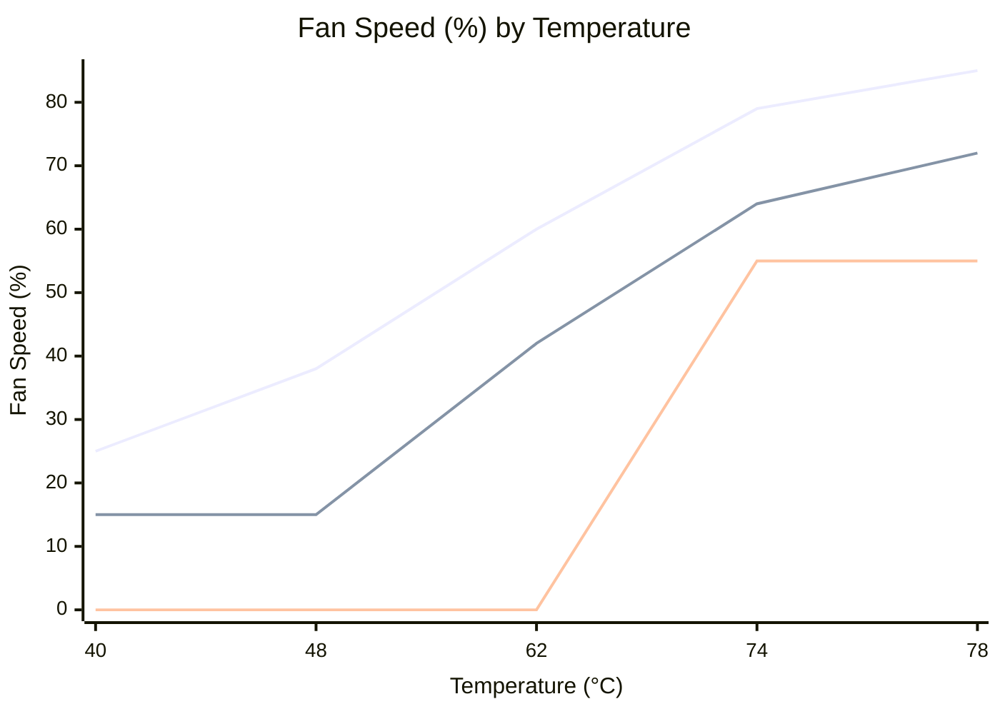
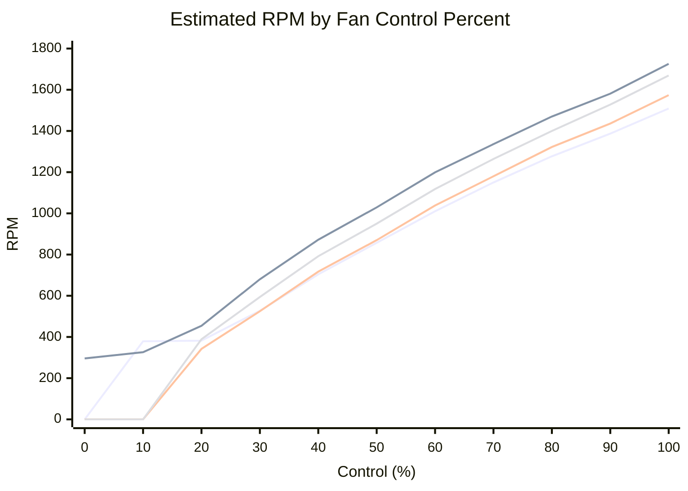

# FanControl Automation for Windows

[中文](./README.md)

[](https://github.com/Yangless/fancontrol/actions/workflows/test.yml)
[](LICENSE)

> A Windows + FanControl automation repository for scheduled profile switching, logon-triggered startup, manual override, runtime verification, and an evolving workflow for model-assisted curve tuning.

## Overview

This repository turns a personal FanControl workflow into a more maintainable Windows automation project. It does more than scheduled profile switching: it also covers logon startup, manual override, forced recovery, status visibility, and runtime verification.

## Why this repository exists

FanControl can load configurations, but it does not provide the full layer needed for time-based switching, temporary manual override, forced recovery points, and verification that the expected config actually became effective.

This repository fills that gap by providing:

- repeatable automation around daily profile switching
- manual intervention without permanently breaking automation
- runtime observability instead of assuming a switch succeeded
- a clear project entry point for ongoing tuning and config evolution

## Current capabilities

- time-based switching between `Game.json` and `Quiet_mode.json`
- logon-triggered startup and config application
- manual override through `switch.ps1`
- forced recovery points at 12:40 and 21:00
- runtime verification through logs, status files, and observer scripts
- separation between repository source and deployed runtime copy

## Architecture at a glance

The repository is organized around three layers:

- `scripts/current/` — source of truth for active scripts
- `C:\FanControl_Auto\` — deployed runtime mirror called by Windows Scheduled Tasks
- `configs/` — tracked FanControl config snapshots

The current config semantics are intentionally distinct:

- `Game.json` means FanControl actively controls fans
- `Quiet_mode.json` means FanControl gives control back to BIOS / EC / GPU defaults

## Quick start

Run the test suite:

```powershell
pwsh -NoProfile -File .\tests\Invoke-FanControlTests.ps1
```

Primary entrypoints:

- Active scripts: `scripts/current/`
- Config snapshots: `configs/`
- Runtime mirror: `C:\FanControl_Auto\`
- Script guide: [`scripts/README.md`](./scripts/README.md)
- Project structure: [`docs/PROJECT_STRUCTURE.md`](./docs/PROJECT_STRUCTURE.md)

If you want the detailed config semantics and tuning background first, start with:

- [`docs/CONFIG_ANALYSIS.md`](./docs/CONFIG_ANALYSIS.md)
- [`docs/CONFIG_ITERATION_GUIDE.md`](./docs/CONFIG_ITERATION_GUIDE.md)

## Repository structure

```text
fancontrol/
├── README.md
├── README.en.md
├── configs/                    # Tracked FanControl config snapshots
├── docs/                       # Structure notes, config analysis, plans, and indexes
├── scripts/
│   ├── current/                # Source of truth for active scripts
│   ├── iterating/              # Candidate scripts and experiments
│   ├── history/                # Historical snapshots and old entrypoints
│   └── README.md               # Script directory guide
├── tests/                      # Pester test suite
└── archive/                    # Historical reports and phase documents
```

For the fuller directory explanation, see [`docs/PROJECT_STRUCTURE.md`](./docs/PROJECT_STRUCTURE.md).

## Current status

- the main switching workflow is stable in the current Windows + FanControl environment
- manual override, forced recovery, state output, and verification already form a usable loop
- source/runtime separation is now explicit
- config analysis and iteration docs exist, so future tuning work has a documented base

## Current Accepted Baseline

An accepted low-RPM baseline was verified on `2026-04-29`:

- Config: [`configs/Game_vNext_stage1_low-rpm.json`](./configs/Game_vNext_stage1_low-rpm.json)
- Status: `accepted-baseline`
- Full experiment log: [`docs/experiments/2026-04-29_stage1-low-rpm.md`](./docs/experiments/2026-04-29_stage1-low-rpm.md)

Current conclusion:

- idle steady-state reduced `TotalTrackedFanRpm` by about `930 RPM` versus `Game.json`
- under GPU-biased stress, `Auto 2` now follows `GPU` temperature and `System Fan #3/#4` finally participate in short high-temperature bursts
- the current baseline passed re-test within guardrails:
  - `CPU Package max = 86°C`
  - `MinDistanceToTjMax min = 16°C`
  - `GPU Temp avg = 77.5°C`

### Temperature-to-Fan Curves

The accepted baseline keeps the current three-layer strategy:

- `Auto`: CPU fan, primary CPU response
- `Auto 1`: second case-fan layer, still CPU-driven
- `Auto 2`: third case-fan layer, now GPU-driven



Notes:

- the three fan layers are overlaid in one chart so their engagement order is easier to compare
- values are projected onto one shared temperature axis from each layer's own `IdleTemperature / LoadTemperature` window
- `System Fan #3/#4` still keep their original `Start/Stop` logic, so low percentages do not guarantee immediate spin-up

### Estimated RPM Curves



This chart is an operating estimate based on FanControl calibration data. It is meant to make the README easier to reason about, not to claim exact instantaneous RPM at every point.

## In progress

The most important active direction is **model-assisted tuning of config curve parameters**.

That means building a safer workflow around:

- understanding how the current `Game.json` behavior performs in real usage
- connecting config analysis, observation, and curve changes into a reusable loop
- keeping tuning observable, reviewable, and reversible
- moving gradually from manual tuning to model-assisted parameter suggestions

## Next

- continue with small adjustments on top of the current `accepted-baseline`, not large curve rewrites
- prioritize observing whether `Auto 2` needs smoother high-GPU-temperature engagement
- revisit `Auto` / `Auto 1` later if more noise reduction is still worth pursuing
- keep collecting real-load samples for a semi-automated, reviewable tuning workflow

## Documentation

| Topic | Document |
|---|---|
| Project structure | [`docs/PROJECT_STRUCTURE.md`](./docs/PROJECT_STRUCTURE.md) (Chinese) |
| Script guide | [`scripts/README.md`](./scripts/README.md) (Chinese) |
| Config analysis | [`docs/CONFIG_ANALYSIS.md`](./docs/CONFIG_ANALYSIS.md) (Chinese) |
| Config iteration guide | [`docs/CONFIG_ITERATION_GUIDE.md`](./docs/CONFIG_ITERATION_GUIDE.md) (Chinese) |
| Document index | [`docs/README_CONSOLIDATED.md`](./docs/README_CONSOLIDATED.md) (Chinese) |
| Historical reports | [`archive/README.md`](./archive/README.md) (Chinese) |

## License

This project is released under the [MIT License](./LICENSE).
