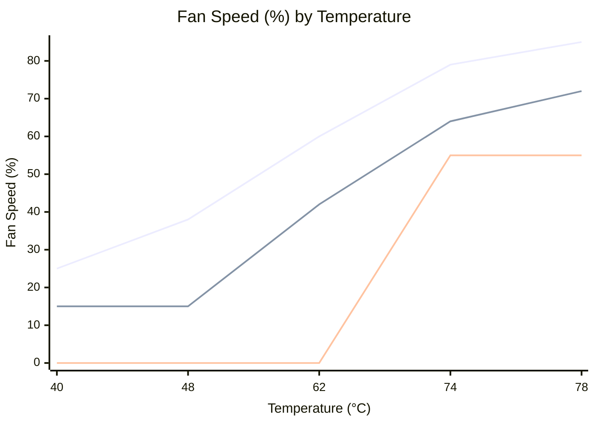
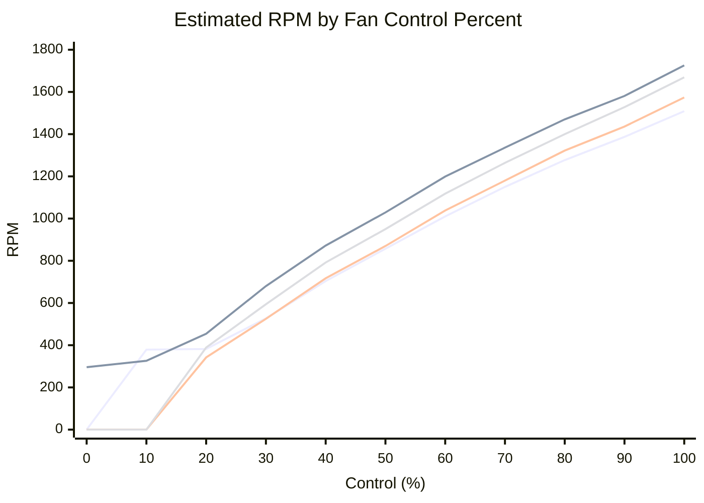

# FanControl 自动化配置切换系统

[English](./README.en.md)

[](https://github.com/Yangless/fancontrol/actions/workflows/test.yml)
[](LICENSE)

> 面向 Windows + FanControl 的自动化配置切换仓库，支持按时段切换、登录触发、手动覆盖、运行期验证，并持续推进通过模型自动调整配置曲线参数的调优工作流。

## 项目概述

这个仓库把个人 FanControl 使用流程整理成一套更可维护的 Windows 自动化方案。它不只是“定时切配置”，还同时处理登录场景启动、手动免打扰、强制恢复、状态观测和运行期验证。

当前仓库的角色已经从单机脚本集合，演进为一个有清晰 source/runtime 边界、可测试、可维护、可继续扩展的自动化项目。

## 为什么有这个仓库

FanControl 本身能够加载配置，但不负责“按时段自动切换 + 手动覆盖 + 自动恢复 + 验证配置是否真的生效”这一整套调度与维护问题。

这个仓库补齐的是这层自动化与治理能力：

- 让日常切换不依赖手工操作
- 让临时手动切换不会永久破坏自动调度
- 让运行结果可观察、可验证，而不是只依赖“脚本执行过了”的假设
- 让配置优化和后续调参有明确的项目入口

## 当前能力

- 按时间窗口自动切换 `Game.json` / `Quiet_mode.json`
- 登录后自动启动 FanControl 并应用当前应使用的配置
- 通过 `switch.ps1` 支持手动切换与恢复自动调度
- 在 12:40 和 21:00 提供强制恢复点，避免长期停留在手动覆盖状态
- 通过状态文件、日志和观察脚本验证配置切换是否实际生效
- 将仓库源码目录与运行目录分离，降低直接改 runtime 的维护风险

## 架构概览

当前仓库按“源码权威目录 / 运行副本 / 配置快照”三层组织：

- `scripts/current/`：当前活跃脚本的 repo source of truth
- `C:\FanControl_Auto\`：任务计划程序直接调用的 runtime mirror
- `configs/`：仓库跟踪中的 FanControl 配置快照

当前两套主配置的语义也已经比较明确：

- `Game.json`：FanControl 主动接管风扇控制
- `Quiet_mode.json`：FanControl 退出主动控制，回到 BIOS / EC / GPU 默认策略

自动调度与手动切换共享同一套运行期状态与切换核心，因此当前项目重点已经从“先跑起来”转向“让行为更稳定、更可解释、更容易继续调优”。

## 快速开始

运行测试：

```powershell
pwsh -NoProfile -File .\tests\Invoke-FanControlTests.ps1
```

快速定位主要入口：

- 当前源码入口：`scripts/current/`
- 当前配置快照：`configs/`
- 当前运行副本：`C:\FanControl_Auto\`
- 脚本说明：[`scripts/README.md`](./scripts/README.md)
- 仓库结构说明：[`docs/PROJECT_STRUCTURE.md`](./docs/PROJECT_STRUCTURE.md)

如果你想直接理解配置逻辑与后续调优背景，优先阅读：

- [`docs/CONFIG_ANALYSIS.md`](./docs/CONFIG_ANALYSIS.md)
- [`docs/CONFIG_ITERATION_GUIDE.md`](./docs/CONFIG_ITERATION_GUIDE.md)

## 仓库结构

```text
fancontrol/
├── README.md
├── README.en.md
├── configs/                    # 跟踪中的 FanControl 配置快照
├── docs/                       # 结构说明、配置分析、计划与索引
├── scripts/
│   ├── current/                # 当前活跃脚本源码
│   ├── iterating/              # 候选脚本与实验迭代
│   ├── history/                # 历史快照与旧入口
│   └── README.md               # 脚本目录说明
├── tests/                      # Pester 测试
└── archive/                    # 历史报告与阶段性文档
```

更完整的目录说明请看 [`docs/PROJECT_STRUCTURE.md`](./docs/PROJECT_STRUCTURE.md)。

## 当前状态

- 自动切换链路已经可以稳定运行在当前 Windows + FanControl 环境中
- 手动 override、强制恢复点、状态写入和验证链路已经形成闭环
- runtime/source 分层已经明确，日常维护不再依赖直接编辑运行目录
- 配置分析文档和迭代指南已经具备，后续调优有了可持续积累的入口

## 当前接受版

`2026-04-29` 已确认一版可继续使用的低转速基线：

- 配置文件：[`configs/Game_vNext_stage1_low-rpm.json`](./configs/Game_vNext_stage1_low-rpm.json)
- 状态：`accepted-baseline`
- 详细实验记录：[`docs/experiments/2026-04-29_stage1-low-rpm.md`](./docs/experiments/2026-04-29_stage1-low-rpm.md)

本轮结论：

- idle 稳态下，`TotalTrackedFanRpm` 相比 `Game.json` 下降约 `930 RPM`
- GPU 偏重烤鸡下，`Auto 2` 已改为跟随 `GPU` 温度，`System Fan #3/#4` 开始在高温段短时介入
- 当前保护线内通过复测：
  - `CPU Package max = 86°C`
  - `MinDistanceToTjMax min = 16°C`
  - `GPU Temp avg = 77.5°C`

### 温度-风扇曲线

当前接受版保留三层结构：

- `Auto`：CPU 风扇，优先响应 CPU
- `Auto 1`：第二层机箱风扇，继续跟随 CPU
- `Auto 2`：第三层机箱风扇，现已改为跟随 GPU



说明：

- 图中将三层风扇曲线叠加在同一坐标系，便于直接比较升温时的介入顺序
- 曲线数值按各自 `IdleTemperature / LoadTemperature` 线性换算到统一温度轴
- `System Fan #3/#4` 仍保留原有 `Start/Stop` 逻辑，所以低百分比阶段并不保证立刻转动

### 占空比-RPM 估算



这张图用于帮助理解“百分比曲线”在实际听感和风量上的大致落点，不代表每个瞬时点都一定精确命中。

## 正在进行

当前最值得关注的方向是：**通过模型自动调整 `config` 中各项曲线参数。**

这项工作不是简单“让模型改 JSON”，而是建立一个更可靠的调优工作流：

- 分析当前 `Game.json` 及相关配置在真实使用下的行为
- 把已有配置分析、采样观察和曲线调整串成可复用流程
- 让参数优化具备可观察、可回退、可比较的基础
- 逐步从人工经验调参过渡到模型辅助参数建议

## 建模工作流

当前第一版建模基础已经接通，目标不是直接让模型在线控风扇，而是先把“采样 -> 数据集 -> baseline 评分 -> 候选配置对比”做成可复用流水线。

当前已具备：

- `scripts/current/monitor_simple.ps1`：统一采集运行状态和硬件指标
- `scripts/current/hardware_metrics.ps1`：补充 CPU / GPU / 风扇 / 频率 / 功耗等硬件观测
- `scripts/modeling/build_training_dataset.py`：把 `docs/experiments/data/` 原始样本整理成训练集
- `scripts/modeling/train_baseline_model.py`：训练当前默认 `ridge_cv` baseline，并同时输出 `ridge` / `random_forest` 对照结果
- `scripts/modeling/score_candidate_config.py`：基于历史样本回放给候选配置打分
- `scripts/modeling/search_candidate_configs.py`：围绕 seed config 做受约束网格搜索并输出候选配置与排序报告
- `scripts/modeling/prepare_candidate_validation.py`：把搜索结果整理成实机验证包，输出候选 manifest 和 checklist

当前文档与交接入口：

- 训练数据 schema：[`docs/modeling/TRAINING_DATA_SCHEMA.md`](./docs/modeling/TRAINING_DATA_SCHEMA.md)
- 新会话交接与待做：[`docs/modeling/NEXT_SESSION_HANDOFF_2026-04-29.md`](./docs/modeling/NEXT_SESSION_HANDOFF_2026-04-29.md)

常用命令：

```powershell
python .\scripts\modeling\build_training_dataset.py `
  --input-root .\docs\experiments\data `
  --config-root .\configs `
  --output-dir .\artifacts\modeling

python .\scripts\modeling\train_baseline_model.py `
  --dataset .\artifacts\modeling\training_rows.jsonl `
  --output-dir .\artifacts\modeling

python .\scripts\modeling\score_candidate_config.py `
  --dataset .\artifacts\modeling\training_rows.jsonl `
  --model .\artifacts\modeling\baseline_model.json `
  --candidate-config .\configs\Game_vNext_stage1_low-rpm.json `
  --baseline-config .\configs\Game.json `
  --output-dir .\artifacts\modeling

python .\scripts\modeling\search_candidate_configs.py `
  --dataset .\artifacts\modeling\training_rows.jsonl `
  --model .\artifacts\modeling\baseline_model.json `
  --seed-config .\configs\Game_vNext_stage1_low-rpm.json `
  --baseline-config .\configs\Game.json `
  --output-dir .\artifacts\modeling

python .\scripts\modeling\prepare_candidate_validation.py `
  --search-summary .\artifacts\modeling\candidate_search_summary.json `
  --output-dir .\artifacts\modeling `
  --top-n 3 `
  --validation-date 2026-04-30
```

## 下一步

- 在当前 `accepted-baseline` 上继续做小步微调，而不是大改整套曲线
- 优先观察 `Auto 2` 是否需要更平滑的 GPU 高温段介入
- 后续如需继续压噪，再回头审视 `Auto` / `Auto 1`
- 继续积累真实负载采样，为半自动、可审查的参数优化提供数据
- 先用受约束搜索器筛出候选，再回到真实负载验证，不直接写回 live config
- 当前默认评分模型是 `ridge_cv`，`random_forest` 只作为非线性对照，不直接替代实机验证

## 文档导航

| 主题 | 文档 |
|---|---|
| 仓库结构 | [`docs/PROJECT_STRUCTURE.md`](./docs/PROJECT_STRUCTURE.md) |
| 脚本说明 | [`scripts/README.md`](./scripts/README.md) |
| 配置分析 | [`docs/CONFIG_ANALYSIS.md`](./docs/CONFIG_ANALYSIS.md) |
| 配置迭代指南 | [`docs/CONFIG_ITERATION_GUIDE.md`](./docs/CONFIG_ITERATION_GUIDE.md) |
| 建模数据 schema | [`docs/modeling/TRAINING_DATA_SCHEMA.md`](./docs/modeling/TRAINING_DATA_SCHEMA.md) |
| 新会话交接 / 待做 | [`docs/modeling/NEXT_SESSION_HANDOFF_2026-04-29.md`](./docs/modeling/NEXT_SESSION_HANDOFF_2026-04-29.md) |
| 文档索引 | [`docs/README_CONSOLIDATED.md`](./docs/README_CONSOLIDATED.md) |
| 历史报告 | [`archive/README.md`](./archive/README.md) |

## License

本项目采用 [MIT License](./LICENSE) 开源。
